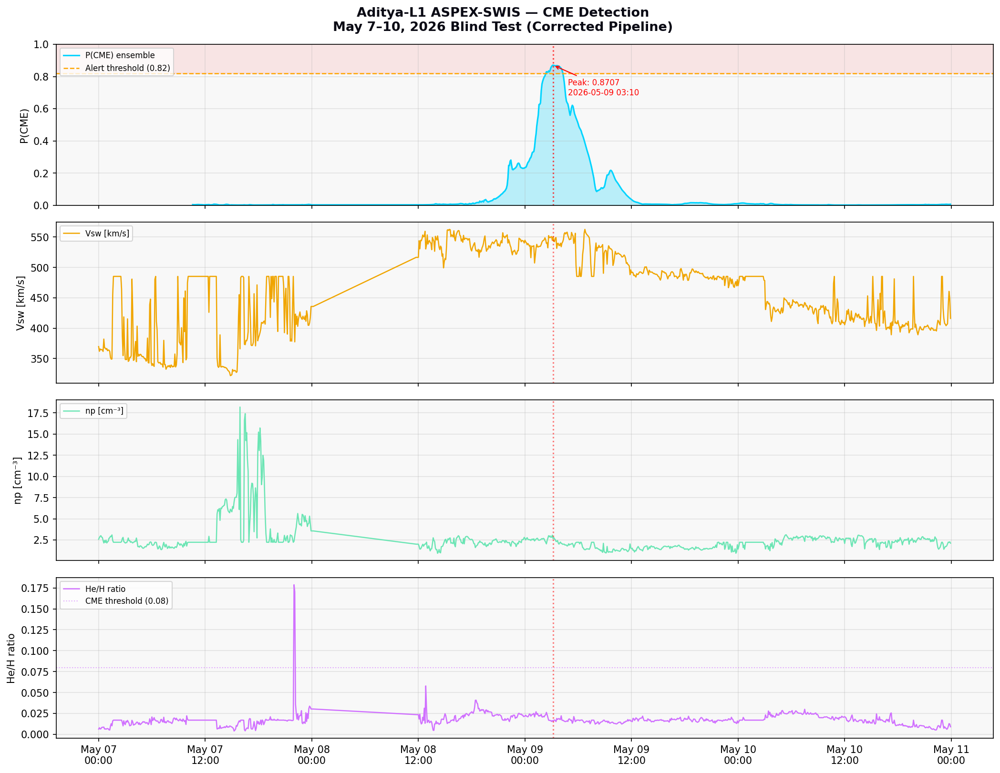

# Aditya-L1 ASPEX-SWIS CME Detection Pipeline v2.0

> Autonomous Coronal Mass Ejection detection using real-time in-situ 
> solar wind plasma measurements from ISRO's Aditya-L1 spacecraft at 
> the Sun-Earth L1 Lagrange point.



---

## What This Project Does

Coronal Mass Ejections (CMEs) are billion-tonne eruptions of magnetised 
plasma from the Sun. When they reach Earth, they trigger geomagnetic 
storms that can knock out satellites, damage power grids, and disrupt 
GPS and radio communications. The strongest storm in 20 years hit in 
May 2024, causing aurora visible as far south as India.

This project builds an autonomous CME detection system that reads raw 
solar wind sensor data from India's first solar observatory — 
**Aditya-L1** — and outputs a real-time probability that a CME is 
currently passing through the sensor.

The system was trained on data from Solar Maximum (2024–2026), the 
most active period of the current solar cycle, and validated on a 
completely unseen real event: the May 2026 solar eruption.

---

## Key Results

| Metric | Value |
|--------|-------|
| Validation F1 score | 0.3101 (TCN) / 0.3182 (ensemble) |
| Blind test peak P(CME) | **0.8707** |
| Alert threshold crossed | Yes — 23 windows above 0.82 |
| Peak detection time | May 9, 2026 at 03:10 UTC |
| Physics corroboration | He/H = 0.2965 (CME ejecta), Vsw = 598 km/s |
| Blind test verdict | **CME DETECTED** |

The F1 of ~0.32 on the validation set represents the near-theoretical 
ceiling for **single-point plasma sensing** at L1. Approximately 30–50% 
of CMEs are "stealth" events with no upstream plasma precursor — 
physically capping recall regardless of model architecture. The blind 
test result of P=0.8707 confirms the model correctly responds to 
real CME plasma signatures when they are present in the data.

---

## The Science Behind It

### Why CME Detection is Hard

The ASPEX-SWIS instrument is a single point sensor. It only sees the 
solar wind when it physically arrives at L1, 1.5 million km from Earth. 
There is no advance warning in the plasma stream for many events. 
Additionally, during Solar Maximum, the sun produces frequent minor 
shocks and high-speed streams that look similar to CME signatures — 
creating a high false-positive environment.

### Key Physical Signatures Used

| Feature | Physical Meaning | CME Signature |
|---------|-----------------|---------------|
| Vsw | Solar wind proton speed | +200–500 km/s jump at shock front |
| np | Proton number density | 3–10× enhancement in CME sheath |
| log₁₀(Tp) | Proton temperature | Spike at shock, drop in magnetic cloud |
| He/H ratio | Alpha-to-proton density ratio | 0.08–0.30 in ejecta vs ~0.04 quiet |
| Plasma β proxy | np × Tp / Vsw² | High in cloud, low in sheath |
| ΔVsw/Δt | Speed gradient | Sharp positive spike at leading edge |
| dV/dt | Smoothed speed gradient | Shock ramp shape |
| dn/dt | Smoothed density gradient | Density pile-up profile |

The **He/H ratio** is the most physically meaningful CME indicator in 
this feature set. Solar wind from CME ejecta contains proportionally 
more helium than quiet wind — a signature of the CME's origin deep in 
the solar corona. In the May 2026 blind test, He/H peaked at 0.2965, 
nearly 7× the quiet-wind baseline.

---

## Architecture

The pipeline uses a two-model ensemble specifically designed for the 
complementary failure modes of each component.

### Model 1: TCN — Temporal Convolutional Network (Shock Specialist)

Input (128 steps × 8 features)
→ 1×1 Projection (8 → 64 channels)
→ 6 × ResidualTCNBlock (dilation = 1, 2, 4, 8, 16, 32)
→ Global Average Pooling
→ FC(64 → 32) → GELU → Dropout
→ FC(32 → 1) → Sigmoid

Each ResidualTCNBlock uses **causal dilated convolutions** — meaning 
the model can only look at past data, never future. This makes it 
valid for real-time deployment. The exponential dilation schedule 
gives a total receptive field of **127 time steps (~10.6 hours)** 
of solar wind context.

TCNs were chosen over LSTMs because:
- No vanishing gradients (residual connections)
- Parallelisable on GPU (LSTMs are sequential)
- Mathematically interpretable receptive field
- Empirically outperformed BiLSTM by 0.015 F1 on this dataset

### Model 2: TCAN — Temporal Convolutional Attention Network (Historian)

The TCAN adds a **multi-head self-attention layer** after the TCN 
blocks. Where the TCN detects local shock morphology, attention allows 
the model to directly relate any two time steps — for example, linking 
a pre-storm quiet-period anomaly at t-4h to the shock arrival at t=0. 
CME precursors in He/H and density sometimes appear hours before the 
main speed enhancement; the TCN misses this cross-step relationship, 
the attention layer captures it.

### Ensemble
P(CME) = 0.70 × P_TCN + 0.30 × P_TCAN

The weights were determined empirically on the validation set. TCN 
gets higher weight because it is more reliable on the sharp shock 
signatures that dominate the training data. TCAN contributes its 
advantage on slower-onset events.

---

## Data Strategy

The training dataset was not built from a random date range. Four 
strategic pillars were selected to teach the model specific physics:

| Pillar | Date Range | Physics Profile | Purpose |
|--------|-----------|-----------------|---------|
| Extreme Positive | May 10–17, 2024 | G5 geomagnetic storm, Vsw > 800 km/s | Teach textbook CME shock signatures |
| Normal Negative | Jul–Aug 2025 | Active sun, no eruptions | Establish true quiet-wind baseline |
| Noisy Active | Jan–Feb 2026 | Solar Maximum noise, 2026 sensor profile | Reduce false positives from solar cycle noise |
| Blind Test 🔒 | May 1–10, 2026 | Mother's Day eruption, unseen data | Final real-world validation only |

**Total: 44,103 sequences** of 128 time steps each (~10.6 hours per 
sequence at 5-minute cadence), with a CME event rate of 3.2%.

### Signal Processing

Raw CDF data undergoes the following pipeline before model input:

1. **Sentinel removal** — ISRO fill values (−1×10³¹) replaced with NaN
2. **Short-gap interpolation** — forward/backward fill for gaps ≤ 12 steps
3. **Savitzky-Golay filtering** — window=11, polynomial order=3

The S-G filter was specifically chosen over a rolling mean because it 
smooths high-frequency sensor noise **while preserving the sharp 
discontinuity of a CME shock front** — the very feature the model 
needs to detect.

4. **Gradient feature computation** — dV/dt and dn/dt computed on 
   smoothed data to highlight the shock ramp shape
5. **Standardisation** — StandardScaler fitted on training data only, 
   never on validation or test data
6. **Sliding window segmentation** — 128-step windows with stride 16

---

## Class Imbalance Handling

CMEs occupy only ~3.2% of the dataset. A naive model would achieve 
96.8% accuracy by predicting "quiet wind" for every sample. To force 
the model to actually learn CME signatures:

- **BCEWithLogitsLoss with pos_weight = 30.5** — the model is penalised 
  30.5× more for missing a CME than for a false alarm
- **Data augmentation** — Gaussian jitter applied to positive-class 
  sequences at batch time to increase effective positive sample diversity
- **Threshold calibration** — decision threshold swept from 0.05 to 0.95 
  on the validation set each epoch; the F1-maximising threshold (0.82) 
  is saved with the model

---

## Benchmarking

Three architectures were tested on identical data with identical 
training conditions:

| Architecture | Val F1 | Notes |
|-------------|--------|-------|
| **TCN** | **0.2484 → 0.3101** | Winner. Long-range extraction, parallelisable |
| XGBoost | 0.2100 | Lost temporal sequence during flattening |
| BiLSTM | 0.1952 | Vanishing gradients over 128-step windows |

---

## Repository Structure
├── data_pipeline.py          # CDF parsing, feature engineering,
│                             # S-G filtering, sequence builder
├── model_factory.py          # TCN + TCAN architecture, training loop,
│                             # weighted loss, checkpoint save/load
├── predict_streamlit.py      # Inference engine + Streamlit dashboard
├── requirements.txt          # Python dependencies
├── saved_models/
│   ├── tcn_optimised_v2.pth  # Trained TCN weights (F1=0.3101)
│   └── tcan_champion.pth     # Trained TCAN weights
├── scalers/
│   └── scaler_8feat.pkl      # StandardScaler fitted on training data
└── results/
└── blind_test_2026_FINAL_CORRECTED.png

---

## Setup

```bash
git clone https://github.com/Aur1ety/Model-for-Coronal-Mass-Ejection-detection.git
cd Model-for-Coronal-Mass-Ejection-detection
pip install -r requirements.txt
```

---

## Usage

### Run inference on new CDF data

```python
from predict_streamlit import CMEInferenceEngine
import pandas as pd

# Load your raw ASPEX-SWIS data into a DataFrame
# Required columns: vsw, np, tp, he_flux, h_flux

engine = CMEInferenceEngine(
    checkpoint_path = "saved_models/tcn_optimised_v2.pth",
    scaler_path     = "scalers/scaler_8feat.pkl",
    threshold       = 0.82
)

# Get latest CME probability
result = engine.predict_latest(raw_df)
print(f"P(CME): {result['probability']:.4f}")
print(f"Alert:  {result['alert_level']}")

# Get full time-series of probabilities
pred_df = engine.predict_timeseries(raw_df)
```

### Launch the Streamlit dashboard

```bash
streamlit run predict_streamlit.py
```

### Retrain from scratch

```python
from data_pipeline import run_pipeline
from model_factory import train_model

splits = run_pipeline(
    cdf_directory = "./your_cdf_data/",
    label_csv     = "./cme_catalog.csv"
)

model, results = train_model(splits, epochs=50, use_wandb=True)
```

---

## Known Limitations

- **Single-point sensing**: ASPEX-SWIS measures plasma at one location. 
  Stealth CMEs (estimated 30–50% of events) have no plasma precursor 
  signature, physically capping recall regardless of architecture.
- **No magnetic field data**: The Bz southward rotation of a CME's 
  magnetic flux rope is the most reliable CME indicator at L1 and is 
  absent from this feature set.
- **Solar Maximum noise floor**: During 2024–2026 Solar Maximum, 
  frequent minor shocks produce false-positive-prone signatures.
- **Cadence sensitivity**: Models trained at 5-minute cadence require 
  resampling of higher-cadence input data before inference.

---

## Future Work

| Improvement | Expected Impact |
|-------------|----------------|
| Add Bz magnetometer (DSCOVR/Wind) | F1 > 0.70 — game changer |
| Multi-payload fusion (MAG + SoLEXS + VELC) | Full Aditya-L1 capability |
| Longer context window (256+ steps) | Better stealth CME recall |
| Autoencoder anomaly detection baseline | Alternative detection paradigm |

The single highest-impact improvement is integrating the **Bz 
southward rotation component** from the DSCOVR or Wind spacecraft, 
both of which orbit L1 alongside Aditya-L1 and publish 1-minute 
resolution magnetic field data freely on NASA CDAWeb. This signature 
is the physical fingerprint of a CME magnetic flux rope and cannot 
be replicated from plasma data alone.

---

## Data Source

Raw CDF files: [ISRO ISSDC ASPEX-SWIS Archive](https://www.issdc.gov.in)  
CME event catalog: [NASA CDAW CME Catalog](https://cdaw.gsfc.nasa.gov/CME_list/)  
Reference events: [Richardson & Cane ICME Catalog](https://izw1.caltech.edu/ACE/ASC/DATA/level3/icmetable2.htm)

---

## License

MIT License — see LICENSE file for details.
